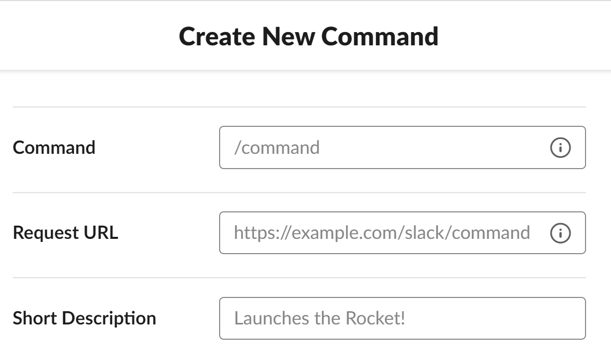
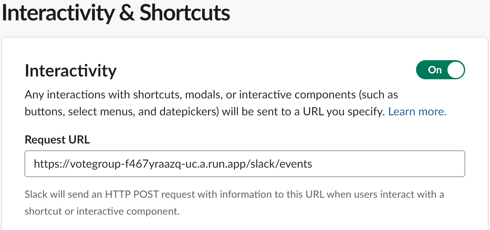

# 概要
帰社日の全体連絡のときに使用します。
- pollyの代わりに参加者を把握するためのボタンを作成
- 期限後に締切ボタンを押すと、帰社日チャンネルを作成し、参加ボタンを押した人を自動で招待します。
- スラッシュコマンド`/kishabi mm/dd`実行すると参加ボタンを作成します。
- 締切ボタンが押せるのは`帰社日運営`というユーザーグループに所属しているメンバーのみです。

# 帰社日polly実行のための設定手順

## 1. SlackAppの権限の設定
※SlackAppの作成方法は省略します  
以下の権限を付与(OAuth&Permission-BotTokenScopes)
- channels:history
- channels:manage
- chat:write
- chat:write.public
- commands
- groups:write
- usergroups:read

***

## 2. SlashCommandsの設定
  

Command ... app.pyの「@app.command("/kisyabi")」と連動しているので変更するならソースも変更  
RequestURL ... 設定するURLに/slack/eventsをつける  
Short Description ... お好み  

***

## 3. TOKENの設定
以下の内容で環境変数設定
```
SLACK_BOT_TOKEN=xoxb-***
SLACK_SIGNING_SECRET=***
```

## 4. インタラクティブメッセージの送信URL設定
参加や締切ボタンを押した時のURL送信先を設定  
 

URLはSlashCommandsのRequestURLと同じ


